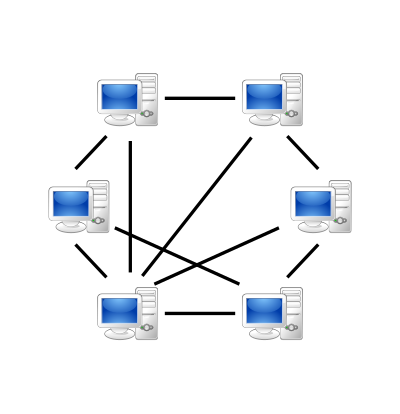

# 4. webRTC

---

## webRTC란?

---

- Web Real-time Communication의 약자로, 웹/앱에서 별다른 소프트웨어 없이 카메라, 마이크 등을 사용하여 실시간 커뮤니케이션을 제공하는 기술
- 화상통화, 화상 공유 등을 구현할 수 있는 오픈소스
- 비디오, 음성 및 일반 데이터가 P2P 방식으로 Peer간 전송되도록 지원
- JavaScript API로 제공

## webRTC 장단점

---

### webRTC 장점

- 낮은 latency를 가지고, real-time과 비슷한 속도를 가진다.
- 웹/앱으로 방송을 켜고 싶을 때도, 별도의 플러그인이나 미디어 송출 관련 소프트웨어를 따로 설치랗 필요가 없다.
- 진입장벽이 낮고 무료다

### webRTC 단점

- 사람들이 잘 사용하지 않는 브라우저나 최신 버전을 사용하지 않는 사용자는 사용이 불가능하다.
- 다른 네트워크 상에서 연결이 이루어지기에, STUN/TURN 서버가 필요하다.

## webRTC 관련 용어들

---

### P2P 통신

- 클라이언트/서버의 개념이 없이 동등한 노드들로 구성되어 데이터를 주고받는 형식

### NAT

- 네트워크 주소 변환
- IP 패킷의 TCP/UDP 포트 숫자와 소스 및 목적지의 IP 주소 등을 재기록하면서 네트워크 트래픽을 주고받는 기술

### Signaling

- P2P 통신이 일어나기 전에 세션 제어 메시지, 네트워크 구성, 미디어 기능 등의 정보를 교환하는 데 사용
- 따라서, P2P 스트리밍을 시작하기 전에 성공적으로 완료되어야 한다.

### SDP(Session Description Protocol)

- 미디어 통신 세션의 설정 정보를 기술하는 포맷
- 오디오, 비디오, 코덱, 포트, IP 주소 등의 정보를 텍스트로 표현한 것으로, 상대 Peer에게 보내야 할 미디어 정보를 담고 있다.

### JSEP(JavaScript Session Establishment Protocol)

- webRTC에서 JavaScript를 사용하여 SDP 를 교환하고 세션을 설정하는 절차 프로토콜
- 개발자가 JavaScript에서 SDP를 다루도록 도와주며, 브라우저 간 연결 협상의 핵심 흐름이다.