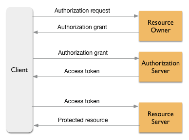

# 5. OAuth 2.0

---

## OAuth 2.0이란?

---

- 어플리케이션이 리소스 소유자 및 HTTP 서비스간의 승인 상호작용을 조정하여 리소스 소유자 대신 엑세스하거나, 타사 어플리케이션이 자체적으로 액세스하도록 허용하여 HTTP 서비스에 제한적으로 액세스할 수있도록 하는 서비스
- 사용자가 앱에 로그인 사용자 인증 정보를 증명하지 않아도, 앱이 사용자의 보호된 리소스에 제한적으로 액세스하도록 허용한다.

## OAuth 2.0 용어

---

### 클라이언트

- 앱이라고 하며, 휴대기기 또는 기존 웹 앱에서 실행되는 앱이다.
- 리소스 소유자를 대신하여 보호된 에셋에 리소스 서버에 요청을 보낸다. 리소스 소유자는 보호된 시소스에 액세스할 수 있는 권한을 앱에 부여한다.

### 리소스 소유자

- 최종 사용자; 보호 대산에 리소스에 대한 액세스 권한을 부여할 수 있는 사람(법인)

### 리소스 서버

- Facebook, Google, X와 같은 서비스, 인트라넷의 HR 서비스 또는 B2B 엑스트라넷 파트너 서비스
- OAuth 토큰 검증이 필요할 때마다 API 요청을 처리하며, 보호된 리소스를 앱에 제공하기 전에 승인을 요구한다.

### 승인 서버

- 승인 부여 검증 및 리소스 서버에서 사용자 데이터에 액세스할 수 있는 앱에 부여하는 액세스 토큰을 발급한다.

### 승인 부여

- 최종 사용자를 대신하여 액세스 토큰을 검색할 수 있는 권한을 앱에 부여한다.

### 액세스 토큰

- 보호된 리소스에 액세스하는 데 사용되는 사용자 인증 정보 역할을 하는 긴 문자열

### 보호된 리소스

- 리소스 소유자가 소유한 데이터
- 예를 들어, 사용자 연락처 목록, 계정 정보, 민감한 정보 등

## OAuth 2.0 흐름

---

1. **Authorization Request (승인 요청)**  
   클라이언트는 리소스 소유자에게 접근 권한을 요청합니다. 이때 사용자(리소스 소유자)는 클라이언트에게 일정 권한을 위임할지 여부를 결정합니다.

2. **Authorization Grant (승인 부여)**  
   리소스 소유자가 접근 권한을 허용하면, 클라이언트는 승인 코드를 받습니다. 이 코드는 Authorization Grant라고 하며, 일종의 인증 코드입니다.

3. **Access Token 요청**  
   클라이언트는 받은 Authorization Grant를 Authorization Server로 전달하여 Access Token을 요청합니다.

4. **Access Token 발급**  
   Authorization Server는 Authorization Grant를 검증하고 유효한 경우, 클라이언트에게 Access Token을 발급합니다.

5. **Protected Resource 요청**  
   클라이언트는 Access Token을 이용해 Resource Server에 보호된 리소스를 요청합니다.

6. **Protected Resource 응답**  
   Resource Server는 Access Token을 검증하고 유효한 경우, 요청된 보호된 리소스를 클라이언트에 응답합니다.

---

## OAuth 2.0 승인 방식 (Grant Types)

---

### 1. Authorization Code Grant (인가 코드 방식)

- 가장 일반적이고 안전한 방식
- 리디렉션 기반이며, 서버 측 애플리케이션에서 사용
- 클라이언트가 인증 코드를 통해 토큰을 요청

### 2. Implicit Grant (암시적 승인 방식)

- 브라우저 기반 애플리케이션에서 사용
- 인증 코드 없이 바로 Access Token을 발급
- 보안상 취약하므로 현재는 잘 사용되지 않음

### 3. Resource Owner Password Credentials Grant (비밀번호 방식)

- 사용자 ID/PW를 직접 입력해 Access Token 요청
- 신뢰된 앱에서만 권장됨

### 4. Client Credentials Grant (클라이언트 자격 증명 방식)

- 클라이언트가 자체적으로 자격 증명을 통해 토큰 요청
- 사용자 개입 없이 시스템 간 통신에서 사용

---

## 보안 고려사항

---

- Access Token은 노출되면 리소스에 무단 접근 가능 → HTTPS 필수
- 토큰 저장 위치는 브라우저라면 LocalStorage보다 Cookie(HttpOnly) 사용 권장
- Refresh Token은 서버에서만 보관하며 클라이언트에 노출되지 않도록 함

