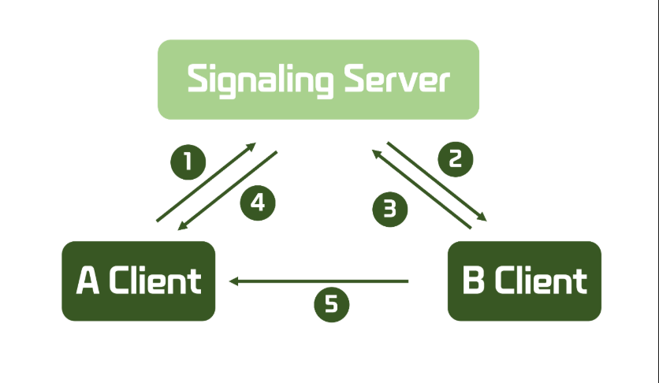

## WebRTC란?
WebRTC(Web Real-Time Communication)는 웹 브라우저나 모바일 애플리케이션에서 실시간 음성, 영상 및 데이터 통신을 가능하게 하는 중요한 구성 요소들

**다음과 같은 기능을 제공**
- 음성 통화(Audo Calling): 브라우저 간에 음성 데이터를 교환
- 영상 통화(Video Calling): 브라우저 간에 영상 데이터를 교환
- 데이터 채널(Data Channel): 텍스트나 파일 같은 데이터 교환

**이러한 기능을 구현하기 위해  webRTC는 다음과 같은 API를 제공**
- getUserMedia(): 사용자 장치의 카메라와 마이크에 접근하는 API
- RTCPeerConnectin: 두 피어(peer) 간에 미디어 스트림을 설정하고 유지하는 API, 이 API는 네트워크 정보를 교환하고 미디어 스트림을 전송
- RTCDataChannel: 피어 간의 데이터 통신을 담당하는 API

하지만 위의 기능들을 사용하려면 먼저 peer 끼리 connection이 되어야 함 

## Signaling 서버란?
- Signaling 서버는 WebRTC에서 두 피어 간의 직접 통신을 설정하기 위해 필요한 초기 연결 정보를 교환하는 데 사용됨
- WebRTC는 브라우저 간의 실시간 통신을 가능하게 하지만, 피어 간의 연결을 설정하는 과정에서 서로의 네트워크 정보를 주고 받아야 함
- 이 과정에서 Signaling 서버가 중요한 역할을 함

**Signaling 서버의 역할**
Signaling 서버는 다음과 같은 정보를 교환하는 역할을 함
1. 세션 관리: 연결 설정, 유지, 종료에 대한 제어 메시지를 주고 받음
2. SDP(Session Description Protocol): 미디어 코텍, 형식, 해상도 및 기타 설정 정보를 포함한 세션 설명을 주고 받음
3. ICE Candidates 교환: 피어가 서로를 찾고 연결할 수 있도록 도와주는 네트워크 경로 정보를 주고받음

**Signaling 과정**

1. Offer 생성: 연결을 시작하는 피어(A)는 RTCPeerConnection 객체를 통해 연결 요청(Offer)을 생성함
2. Offer 전달: 생성된 Offer를 Signaling 서버를 통해 상대 피어(B)에게 전달함
3. Answer 생성: 피어(B)는 Offer를 받고, 자신의 설정 정보를 포함한 응답(Answer)을 생성함
4. Answer 전달: 생성된 Answer를 Signaling 서버를 통해 피어(A)에게 전달함
5. ICE Candidates 교환: 양쪽 피어는 자신의 네트워크 정보를 포함한 ICE Candidates를 서로 교환함

## SocketHandler 코드
```java
@Component
@Slf4j
public class SocketHandler extends TextWebSocketHandler {

    /**
     * 방 번호(UUID)를 키로 하고, 해당 방에 속한 WebSocket 세션 목록을 값으로 가지는 ConcurrentHashMap임
     * 각 방에 연결된 WebSocket 세션들을 관리함
     */
    private final ConcurrentHashMap<UUID, List<WebSocketSession>> roomSessions = new ConcurrentHashMap<>();

    /**
     * 클라이언트로부터 텍스트 메시지를 수신했을 때 호출됨
     * 수신한 메시지를 같은 방에 있는 다른 클라이언트들에게 전달함
     * URI 경로에서 방 번호(UUID)를 추출하고, 해당 방에 속한 세션들에게 메시지를 전송함 
    */
    @Override
    public void handleTextMessage(WebSocketSession session, TextMessage message) throws IOException {
        URI uri = session.getUri();
        String path = uri.getPath();
        String uuid = path.substring(path.lastIndexOf('/') + 1);
        UUID rno = UUID.fromString(uuid);

        List<WebSocketSession> sessionsInRoom = roomSessions.get(rno);

        if(sessionsInRoom != null) {
            for(WebSocketSession webSocketSession : sessionsInRoom) {
                // 세션이 열려있고, 자신의 세션이 아닌 다른 사용자의 세션일 경우 메세지 전달
                if(webSocketSession.isOpen() && !session.getId().equals(webSocketSession.getId())) {
                    // ice, offer, answer 를 세션에 연결된 각각의 client 에 전달
                    webSocketSession.sendMessage(message);
                }
            }
        }
    }

    /**
     * 새로운 WebSocket 연결이 성공적으로 맺어졌을 때 호출됨
     * 클라이언트를 해당 방에 추가함
     * URI 경로에서 방 번호(UUID)를 추출하고, ConcurrentHashMap에서 해당 방의 세션 목록에 새 세션을 추가함
     */
    @Override
    public void afterConnectionEstablished(WebSocketSession session) throws Exception {
        log.info("WebSocket connection established: session ID = {}", 
        session.getId());
        
        URI uri = session.getUri();
        String path = uri.getPath();
        String uuid = path.substring(path.lastIndexOf('/') + 1);
        UUID rno =  UUID.fromString(uuid);

        List<WebSocketSession> sessionsInRoom = roomSessions.computeIfAbsent(rno, k -> new CopyOnWriteArrayList<>());
        sessionsInRoom.add(session);

        log.info("Number of connections in room {}: {}", rno, sessionsInRoom.size());
    }

    /**
     * WebSocket 연결이 종료되었을 때 호출됨
     * 클라이언트를 해당 방에서 제거함
     * URI 경로에서 방 번호(UUID)를 추출하고, ConcurrentHashMap에서 해당 방의 세션 목록에서 세션을 제거함
     */
    @Override
    public void afterConnectionClosed(WebSocketSession session, CloseStatus status) throws Exception {
        log.info("WebSocket connection closed: session ID = {}, status = {}", session.getId(), status);

        URI url = session.getUri();
        String path = url.getPath();
        String uuid = path.substring(path.lastIndexOf('/') + 1);
        UUID rno = UUID.fromString(uuid);

        List<WebSocketSession> sessionsInRoom = roomSessions.get(rno);

        if(sessionsInRoom != null) {
            sessionsInRoom.remove(session);
            log.info("Number of connections in room {}: {}", rno, sessionsInRoom.size());
        }
    }
}

```
## SocketHandler 코드 설명
- 위 코드는 Spring WebSocket을 사용하여 WebSocket 연결을 관리하는 SocketHandler 클래스를 구현함
- 이 클래스를 TextWebSocketHandler를 확장하며, WebSocket 연결의 수명 주기 동안 발생하는 이벤트를 처리함
- 또한, 방(room) 개념을 도입하여 특정 방에 속한 사용자들끼리 메시지를 주고 받을 수 있도록 함

**동시성 제어의 필요성**
- 위 코드는 여러 클라이언트가 동시에 WebSocket을 통해 서버와 상호작용할 수 있기 때문에 동시성 제어가 필요함
- 동시성 문제는 여러 클라이언트가 동시에 동일한 데이터 구조를 수정하려고 할 때 발생할 수 있음
- 방에 속한 세션 목록을 관리하는 roomSessions와 각 방의 세션 목록(List<WebSocketSession>)은 동시에 접근될 가능성이 큼
1. 데이터 무결성 보장
    - 여러 스레드가 동시에 roomSessions 맵이나 각 방의 세션 목록을 수정할 때, 데이터의 일관성을 유지해야 함
    - 그렇지 않으면 데이터 손실이나 예기치 않은 동작이 발생할 수 있음
2. 경합 조건 방지
    - 두 개 이상의 스레드가 동시에 동일한 자원에 접근하여 변경할 때 발생하는 문제를 방지함
    - 예를 들어, 한 스레드가 세션을 추가하는 동안 다른 스레드가 세션을 제거하려고 하면, 비정상적인 상태가 될 수 있음
3. 성능 최적화
    - 동기화 메커니즘을 적절히 사ㅣ용하여 성능 저하를 최소화할 수 있음
    - ConcurrentHashMap과 CopyOnWriteArrayList는 높은 동시성을 제공하면서도 성능을 최적화함

**동시성 제어의 구체적인 구현**
1. ConcurrentHashMap 사용
    - ConcurrentHashMap은 고성능 동시성을 제공하는 해시 맵임
    - 여러 스레드가 동시에 읽기와 쓰기를 수행할 수 있도록 설계됨
2. CopyOnWriteArrayList 사용
    - CopyOnWriteArrayList는 리스트에 대한 쓰기 작업이 발생할 때마다 내부 배열을 복사하여 쓰기 작업이 일어나는 동안에도 안전한 읽기를 보장함
    - 방에 속한 세션 목록을 관리하는 데 사용되며, 동시 읽기와 쓰기 작업이 빈번하지 않은 경우에 적합함

**위 코드에서 동시성 제어를 좀 더 추가할 필요가 있음**