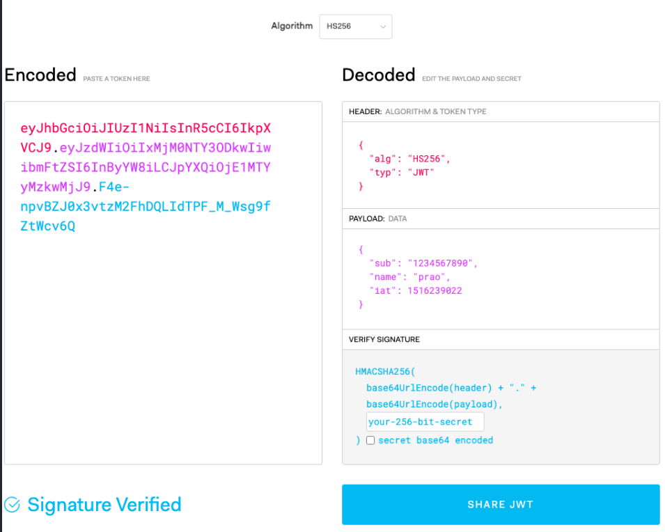
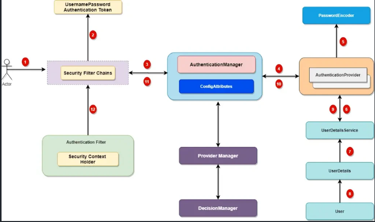
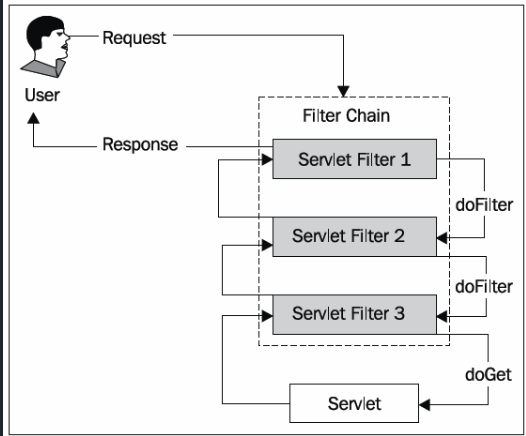

# JWT(Json Web Token)
- JWT는 당사자 간에 정보를 JSON 객체로 안전하게 전송하기 위한 토큰 기반의 표준
- 주로 인증(Authentication)과 인가(Authorization)에 사용됨

**왜 JWT를 사용하나**
- Stateless: 서버에 세션 정보를 저장하지 않음
- 확장성: 마이크로서비스 환경에서 유리
- Cross-Domain: 도메인 간 인증 가능
- Mobile-Friendly: 모바일 앱에서 사용하기 적합

## JWT 구조
JWT는 Header, Payload, Signature 3부분으로 구성됨

1. Header
- 토큰 타입과 해싱 알고리즘 정보
- Base64로 인코딩
- alg: 인코딩에 사용되는 해싱 알고리즘 종류
- typ: 토큰의 타입, JWT

2. Payload
- 실제 전달할 정보(Claims)
- 사용자 정보, 권한, 만료시간 등
- Base64로 인코딩
- 토큰에 담을 정보가 들어감
- JSON 쌍으로 구성
- 등록된 클레임: 토큰의 기본 정보를 담기 위한 이름이 정해져 있는 정보
    - iss: 토큰 발급자
    - sub: 토큰 제목
    - aud: 토큰 대상자
    - exp: 토큰의 만료 시간, 해당 시간이 끝난 이후에는 사용 불가
    - iat: 토큰이 발급된 시간
    - nbf: 토큰의 활성화 시간, 해당 시간이 지나기 전에는 사용 불가
- 공개 클레임
    - 원하는 대로 정의한 클레임
    - 충돌이 방지된 이름을 가지고 있어야 함(URI 형태로 정의)
- 비공개 클레임
    - 서비스에서 공유하기 위한 정보를 담은 클레임
    - 이름이 중복되어 충돌 가능
    - 인증에서의 사용자 ID 등이 이곳에 담김

3. Signature
- 유효성을 검증하기 위한 부분
- 헤더의 인코딩 값과 페이로드의 인코딩 값을 합친 후 토큰을 생성할 때 사용된 Secret Key를 통해 암호화하여 생성

### 인증 흐름
1. 클라이언트가 로그인 요청(ID/PW)
2. 서버에서 인증 후 JWT 토큰 생성
3. 클라이언트에게 토큰 반환
4. 클라이언트는 이후 요청시 헤더에 토큰 포함
5. 서버는 토큰 검증 후 요청 처리

### 인가
1. 클라이언트는 API 요청 시 HTTP 헤더에 인증 과정을 거친 후 발급받은 토큰을 포함시켜 요청
2. 서버는 헤더에 포함된 토큰을 Secret Key를 통해 Signature 부분의 유효성 검증
3. 유효한 토큰이라면 인가에 성공했으며 API 요청 처리 및 응답
4. 클라이언트는 API의 응답을 받음

## Access Token & Refresh Token
### JWT 토큰의 단점, 해결방안
**단점**
- Payload 부분은 단순히 base64 형식으로 인코딩한 수준 -> 안의 데이터 볼 수 있음 -> 민감한 데이터 넣지 않음
- 이미 발급된 토큰에 대해서는 사용자의 인증과 인가 처리를 무효화하기 어려움 -> 토큰 탈취 사용될 우려

**해결방안**
- 위의 문제점을 극복하기 위해 토큰 만료 시간을 짧게 주어 탈취 당하여 사용되기 이전에 무효화시키는 방법 사용
- 이를 위해 도입된 개념이 Access Token & Refresh Token

### JWT Access / Refresh Token 인증 플로우
- 토큰 만료시간을 짧게 주면 다시 인증과정을 거쳐 재발급을 받아야 함
- 따라서 다시 로그인과 같은 인증 과정을 거치지 않고 Refresh Token을 통해서 인증 과정을 대신함
- Access Token: 평상시 API 인가에 사용되는 토큰
- Refresh Token: Access Token이 만료되었을 때 헤더에 포함시켜서 Access Token 재발급 요청을 하는 데 사용
- 보통 Access Token은 시간을 2 ~ 5분 내외로 짧게 주는 반면 Refresh Token은 2주 정도로 길게 주는 편

### 인증
- 앞의 인증 플로우와 다른 점은 인증 완료 시 Access Token과 함께 Refresh Token을 발급

### 인가와 토큰 재발급
- 인가 중 Access Token이 만료되었을 때 클라이언트에 만료되었음을 응답으로 보냄
- 클라이언트는 만료되었음을 확인하고 Refresh Token을 헤더에 실어서 Access Token의 재발급 요청
- 서버는 마찬가지로 Refresh Token의 유효성을 검증한 후 Access Token을 재발급
- 재발급된 Access Token으로 API 요청

## Spring Security
- 스프링 프레임워크에서는 인증 및 권한 부여로 리소스 사용을 컨트롤 할 수 있는 Spring Security를 제공
- API에 권한 기능이 없으면 아무나 회원 정보를 조회하고 수정할 수 있음
- 따라서, 이를 막기 위해 인증된 유저만 API를 사용할 수 있도록 해야하는데, 이때 사용할 수 있는 해결책 중 하나가 Spring Security

 
- Spring Security는 스프링의 DispatcherServlet 앞단에 Filter 형태로 위치함
- Dispatcher로 넘어가기 전에 Filter가 요청을 가로채서 클라이언트의 리소스 접근 권한을 확인하고, 없는 경우에는 인증 요청 화면으로 자동 리다이렉트함

### Spring Security Filter

- 그림에서 클라이언트가 리소스에 대한 접근 권한이 없을 때 처리를 담당하는 필터는 UsernamePasswordAuthenticationFilter임
- 인증 권한이 없을 때 오류를 JSON으로 내려주기 위해 해당 필터가 실행되기 전 처리가 필요함

### API 인증 및 권한 부여를 위한 작업 순서
1. 회원가입 & 로그인 API 구현
2. 리소스 접근 가능한 ROLE_USER 권한을 가입 회원에게 부여
3. Spring Security 설정에서 ROLE_USER 권한을 가지면 접근 가능하도록 세팅
4. 권한이 있는 회원이 로그인 성공하면 리소스 접근 가능한 JWT 토큰 발급
5. 해당 회원은 권한이 필요한 API 접근 시 JWT 보안 토큰을 사용

위와 같이 접근 제한이 필요한 API에는 보안 토큰을 통해서 이 유저가 권한이 있는지 여부를 Spring Security를 통해 체크하고 리소스를 요청할 수 있도록 구성할 수 있음

## 인증 및 인가를 구현할 때 사용되는 개념
### Filter 체인
- Spring Security는 다양한 Filter들의 체인으로 구성
- 이 Filter 체인은 Request를 가로챈 후 일련의 절차를 처리
- UsernamePasswordAuthenticationFilter는 사용자가 제출한 인증정보 처리

### UsernamePasswordAuthenticationTOken 생성
- UsernamePasswordAuthenticationFilter는 UsernamePasswordAuthenticationToken을 생성하여 AuthenticationManager에게 전달
- 이 토큰에는 사용자가 제출한 인증 정보가 포함되어 있음

### AuthenticationManager
- AuthenticationManager는 실제로 인증을 수행
- 여러 AuthenticationProvider들을 이용

### AuthenticationProvider
- 각각의 Provider들은 특정 유형의 인증을 처리
- Ex. DaoAuthenticationProvider는 사용자 정보를 DB에서 가져와 인증을 수행

### PasswordEncoder
- 인증과 인가에서 사용될 패스워드의 인코딩 방식을 지정

### UserDetailService
- AuthenticationProvider는 UserDetailService를 사용하여 사용자 정보를 가져옴
- UserDetailService는 사용자의 아이디를 받아 loadByUsername을 호출하여 해당 사용자의 UserDetails를 반환

### UserDetails
- UserDetails에는 사용자의 아이디, 비밀번호, 권한 등이 포함

### Authentication 객체 생성
- 인증에 성공하면, AuthenticationProvider는 Authentication 객체를 생성하여 AuthenticationManager에게 반환
- Authentication 객체에는 사용자의 세부 정보와 권한이 포함

### SecurityContextHolder
- 현재 실행 중인 스레드에 대한  SecurityContext를 제공

### SecurityContext
- 현재 사용자의 Authentication이 저장되어 있음
- 애플리케이션은 SecurityContextHolder를 통해 현재 사용자의 권한을 확인하고 인가 결정을 함
