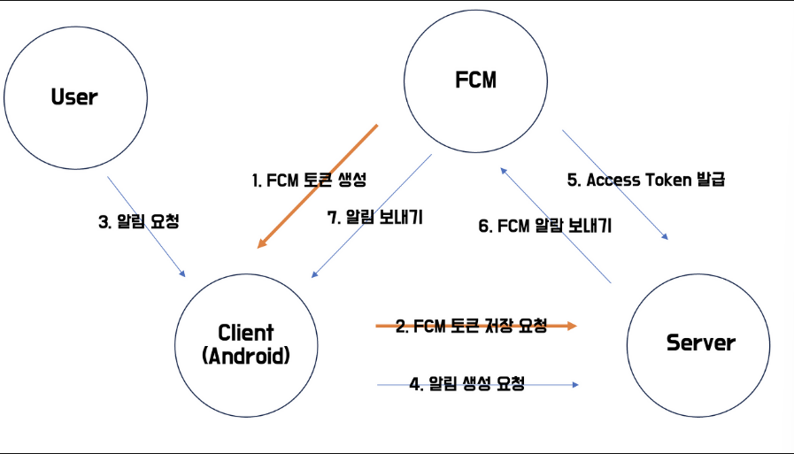
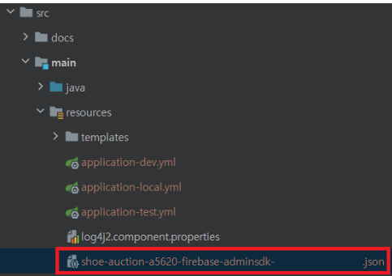
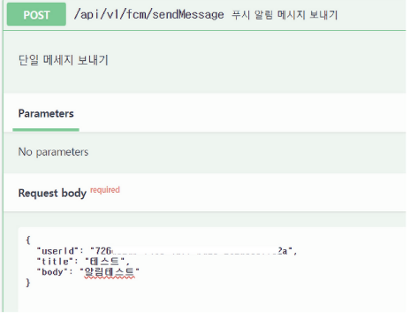

# FCM(Firebase Cloud Messaging)
- Firebase Cloud Messaging(FCM)은 구글이 제공하는 클라우드 기반의 메시징 솔루션
- 앱 개발자들이 사용자의 Android, iOS, 웹 애플리케이션에 무료로 알림을 보낼 수 있게 해줌
- FCM은 푸시 알림 뿐만 아니라 앱 내 메시지 기능도 지원하며, 간단한 설정과 코드 몇 줄만으로 대규모의 메시지를 신속하게 전송 가능

## FCM 동작 과정

1. FCM 토큰 생성
- 주체: User -> FCM
- 동작: 사용자가 앱을 처음 실행하거나 앱이 시작될 때, FCM 서비스에 토큰 생성을 요청함
- 목적: 해당 기기/앱을 고유하게 식별할 수 있는 토큰을 생성하기 위함

2. FCM 토큰 저장 요청
- 주체: Client(Android) -> Server
- 동작: 안드로이드 클라이언트가 FCM으로부터 받은 토큰을 서버에 전송하여 저장을 요청함
- 목적: 서버가 나중에 이 기기로 푸시 알림을 보낼 수 있도록 토큰을 저장해둠

3. 앱의 요청
- 주체: User -> Client(Android)
- 동작: 사용자가 앱에서 특정 액션을 수행하거나 앱을 사용함
- 목적: 이것이 푸시 알림을 트리거하는 사용자 행동

4. 앱의 생성 요청
- 주체: Client(Android) -> Server
- 동작: 클라이언트가 서버에 특정 작업이나 알림 생성을 요청함
- 목적: 서버가 푸시 알림을 보낼 필요가 있는 상황을 알리는 단계

5. Access Token 발급
- 주체: Server -> FCM
- 동작: 서버가 FCM 서비스에 인증을 위한 Access Token을 요청하고 발급 받음
- 목적: FCM API를 사용하여 푸시 알림을 보내기 위한 인증 과정

6. FCM 알림 보내기
- 주체: Server -> FCM
- 동작: 서버가 FCM 서비스에 푸시 알림 전송을 요청함
- 실제 푸시 알림 메시지를 FCM 서비스로 전달하는 단계

7. 알림 보내기
- 주체: FCM -> Client(Android)
- 동작: FCM 서비스가 최종적으로 안드로이드 클라이언트에게 푸시 알림을 전송함
- 목적: 사용자의 기기에 실제 알림이 표시되는 최종 단계

## FCM 토큰
- 사용자 기기 구분을 위한 토큰
- 디바이스마다 고유함
- FCM 토큰을 사용해서 어떤 기기에 알림을 보내야 하는지 구분함
- 프론트가 해당 기기의 FCM 토큰을 얻어서 서버에 보내줘야 함
- 보통 로그인하거나 앱을 실행할 때 서버에 FCM 토큰을 보내주면 된다고 함

## FCM 토큰이 변경되는 경우
**앱이 설치된 디바이스를 추가하거나 삭제할 때 토큰이 변경될 수 있음**
- 앱이 인스턴스 ID를 삭제한 경우
- 앱이 새 기기에서 복원된 경우
- 사용자가 앱을 제거하거나 재설치한 경우
- 사용자가 앱 데이터를 지운 경우

## FCM을 Spring Boot 프로젝트에 적용하기
1. FCM을 사용할 프로젝트에 firebase-admin 의존성을 추가해줌
```java
// build.gradle

implementation  'com.google.firebase:firebase-admin:7.3.0'
```
- 설정 후 Firebase 콘솔에 접속해서 로그인 한 후 프로젝트를 생성하고, 프로젝트 설정 -> 서비스 계정 항목에서 새 비공개 키 생성으로 비공개 키를 생성
- 생성된 admin sdk는 json 파일로 생성되며, 생성된 파일을 프로젝트의 resource 디렉토리로 이동



2. Firebase 설정 초기화
```java
@Service
public class Firebaseinitialization {
    
    @PostConstruct
    public void initialize() {
        try {
            FileInputStream serviceAccount = new FileInputStream("./src/main/resources/firebase-service-account.json");

            FirebaseOptions options = new FirebaseOptions.Builder().setCredentials(GoogleCredentials.fromStream(serviceAccount)).build();

            FirebaseApp.initializeApp(options);

        } catch(IOException e) {
            e.printStackTrace();
        }
    }
}

```

3. FCM 메시지 보내기
**구현 순서**
A. FcmMessageRequestDto
- 푸시 알림을 보낼 때 필요한 정보를 담을 DTO를 정의함
- 웹에서 발송 대상을 선택하고, 알림 제목과 내용을 작성
```java
@Getter
@NoArgsConstructor
@AllArgsConstructor
public class FcmMessageRequestDto {

    @Schema(description = "유저ID")
    private String userId;

    @Schema(description = "메시지 제목")
    private String title;

    @Schema(description = "메시지 내용")
    private String body;
}

```

B. FirebaseController
- [POST] '/api/v1/fcm/sendMessage'로 푸시 메시지 제목, 내용(FcmMessageRequestDto)을 파라미터로 전달
- 클라이언트로부터 푸시 알림 전송 요청을 받아 FirebaseCloudMessageService 로 전달하는 역할
```java
@RestController
public class FirebaseController {
    
    private final FirebaseMessageService firebaseMessageService;

    @Autowired
    public FirebaseController(FirebaseMessageSerivce 
    firebaseMessageService) {
        this.firebaseMessageService = firebaseMessageService;
    }

    @PostMapping("/api/v1/fcm/sendMessage")
    public ResponseEntity<String> sendMessage(@RequestBody FcmMessageRequestDto requestDto) {
        String response = firebaseMessageService.sendMessage(requestDto);
        return ResponseEnttiy.ok(response);
    }

}
```

C. FirebaseCloudMessageService
- 전달받은 파라미터에 따라 푸시 알림 메시지를 전송함
- [GET] userService.findByUserFcm(userId)로 알림 발송할 유저의 firebasetoken 정보를 조회하여 해당 디바이스로 전달받은 파라미터를 푸시 알림 메시지로 전송함
```java
@Service
public class FirebaseCloudMessageService {
    
    private final UserService userService;

    public String sendMessage(FcmMessageRequestDto requestDto) {
        // 사용자의 Firebase 토큰 값을 조회
        String userFirebaseToken = userService.findFirebaseTokenByUserId(request.Dto.userId);

        // 메시지 구성
        Message message = Message.builder()
            .putData("title", requestDto.getTitle())
            .putData("content", requestDto.getContent())
            .setToken(userFirebaseToken)  // 조회한 토큰 값을 사용
            .build();

        try {
            // 메시지 전송
            String response = FirebaseMessagin.getInstance().send(message);
            return "Message sent successfully." + response;
        } catch (FirebaseMessagingExceptino e) {
            e.printStackTrace();
            return "Failed to send message";
        }
    }
}

```

D. 테스트
- Postman을 사용하여 /api/v1/fcm/sendMessage에 요청을 보내 푸시 알림 전송 테스트를 진행함

