# OAuth
## OAuth의 개념 이해
- Open Authorization의 약자임
- 애플리케이션이 특정 시스템의 보호된 리소스에 접근하기 위해, 사용자 인증(Authentication)을 통해 사용자의 리소스 접근 권한(Authorization)을 위임받는 것을 의미함
- 즉, 사용자 인증을 위한 개방형 표준 프로토콜임
- OAuth는 카카오, 구글, 애플, 페이스북 등 다양한 회사에서 지원함

## 카카오 로그인 방식의 이해
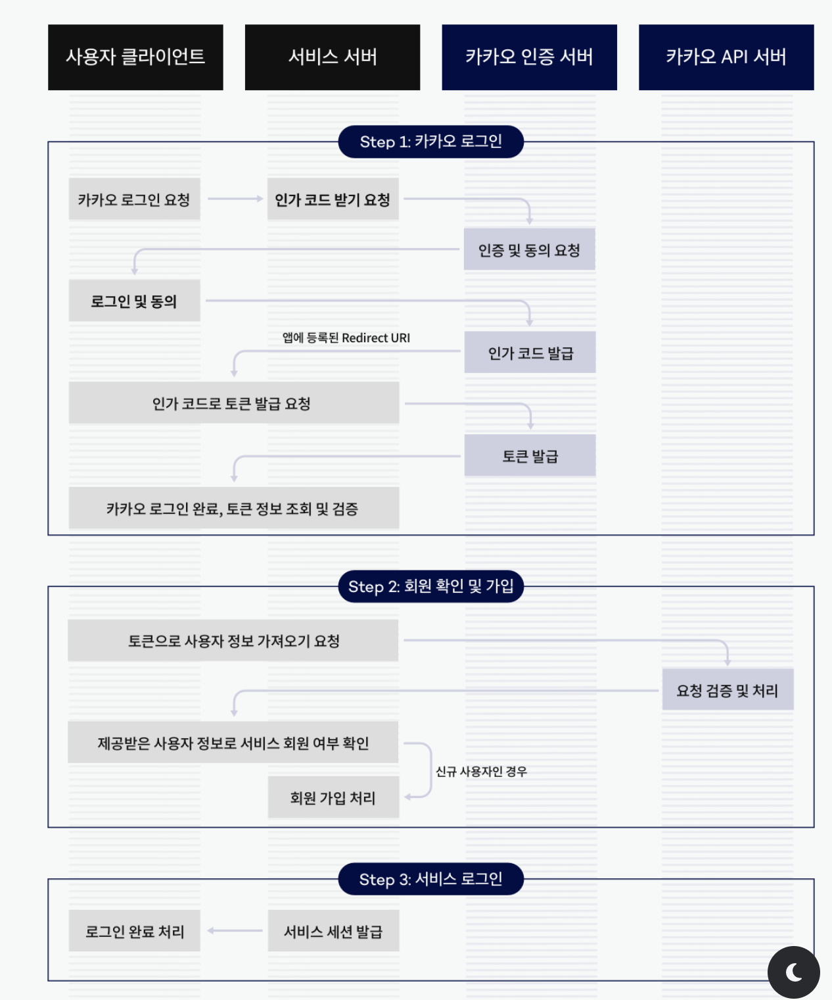
위 그림에서 카카오 인증 서버와 카카오 API 서버를 각각 카카오의 인증[로그인 처리]을 위한 서버 / 카카오의 백엔드 서버[사용자 정보 등을 가져옴]라고 생각하면 편함

### STEP 1: 카카오 로그인
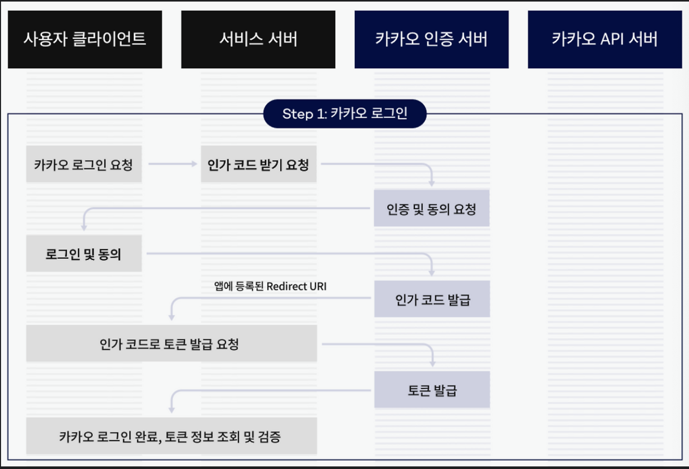
1. 카카오 로그인 요청
- 사용자가 프론트 단에서 "카카오로 로그인" 버튼을 클릭함
- 이때 서비스 서버는 카카오 인증 서버로 리다이렉트 할 URL을 생성함
~~~
https://kauth.kakao.com/oauth/authorize? client_id=YOUR_CLIENT_ID&redirect_uri=YOUR_REDIRECT_URI&response_type=code
~~~

2. 인가 코드 받기 요청
- 사용자의 브라우저가 위 URL로 리다이렉트 됨
- 카카오 인증 서버는 사용자에게 카카오 계정으로 로그인할 것을 요청함

3. 로그인 및 동의
- 사용자는 해당 로그인 페이지에서 카카오 계정으로 로그인함
- 카카오는 사용자에게 서비스가 요청한 권한(예: 프로필 정보 접근)에 대한 동의를 구함

4. 인가 코드 발급
- 사용자가 동의하면, 카카오 인증 서버는 사용자를 우리가 지정한 redirect_uri로 리다이렉트 시킴
~~~
http://localhost:8080/auth/login/kakao
http://localhost:3000/auth/login/kakao
~~~
- 사용자가 카카오 로그인을 완료하면, 카카오는 사용자를 이 스프링 서버 URL로 리다이렉트 시킬 것이고, 이 URL에는 인증 코드(authorization code)가 쿼리 파라미터로 포함됨
~~~
https://your-redirect-uri?code=AUTHORIZATION_CODE
~~~
- 스프링 서버는 이 인증 코드를 받아 처리함
- 서버로 리다이렉트하여 코드 검증이 이루어지면 좋은 점은 보안성과 편리함
    - 인증 코드가 프론트엔드를 거치지 않고 직접 백엔드로 전달된다는 점과, 백엔드에서 한 번에 간편하게 처리할 수 있다는 점이 좋음
**하지만 요즘 웹 애플리케이션에서는 프론트엔드로 리다이렉트하여 OAuth 인증을 처리하는 방식을 선호함**

5. 토큰으로 교환 요청
- 서비스 서버는 이 인가 코드를 이용해 카카오 인증 서버에 엑세스 토큰을 요청함 
~~~
POST https://kauth.kakao.com/oauth/token
Content-Type: application/x-www-form-urlencoded grant_type=authorization_code&client_id=YOUR_CLIENT_ID&redirect_uri=YOUR_REDIRECT_URI&code=AUTHORIZATION_CODE
~~~

6. 토큰 발급
- 카카오 인증 서버는 유효한 요청이면 액세스 토큰과 리프레스 토큰을 발급함
~~~
HTTP/1.1 200 OK
Content-Type: application/json;charset=UTF-8
{
    "token_type":"bearer",
    "access_token":"${ACCESS_TOKEN}",
    "expires_in":43199,
    "refresh_token":"${REFRESH_TOKEN}",
    "refresh_token_expires_in":5184000,
    "scope":"account_email profile"
}
~~~

### STEP 2: 회원 확인 및 가입 / 로그인

1. 토큰으로 사용자 정보 가져오기
- 서비스 서버는 발급받은 액세스 토큰을 이용해 카카오 API 서버에 사용자 정보를 요청함
~~~
GET https://kapi.kakao.com/v2/user/me
Authorization: Bearer ACCESS_TOKEN
~~~

2. 회원 여부 확인
- 카카오에서 받은 사용자 정보 중 카카오 계정의 고유 ID를 이용해(식별자로써 중복 불가능하다면 email 등을 활용해도 됨) 해당 사용자가 이미 여러분의 서비스에 가입되어 있는지 확인함
- 이러한 고유 식별자 사용자 정보를 통해 DB를 검색 후, 가입된 사용자라면 로그인을 해주고 아니라면 회원 가입을 해줌

3. 신규 사용자 회원 가입 처리
- 만약 신규 사용자라면, 카카오에서 받은 정보를 바탕으로 우리 서비스에 회원가입을 시킴
- 이때 추가 정보 입력이 필요하다면 사용자에게 추가 정보를 요청할 수 있음

4. 기존 사용자 로그인 처리
- JWT(JSON Web Token)를 생성하여 클라이언트에게 반환

## 구현 전 Kakao Developer Setting
### 애플리케이션 생성
https://developers.kakao.com/console/app
우선, 해당 Kakao Developer에서 애플리케이션을 추가해줘야 함
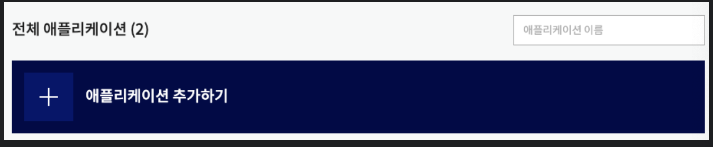

1. 그런 다음, 알맞은 정보를 입력하고 저장을 누름
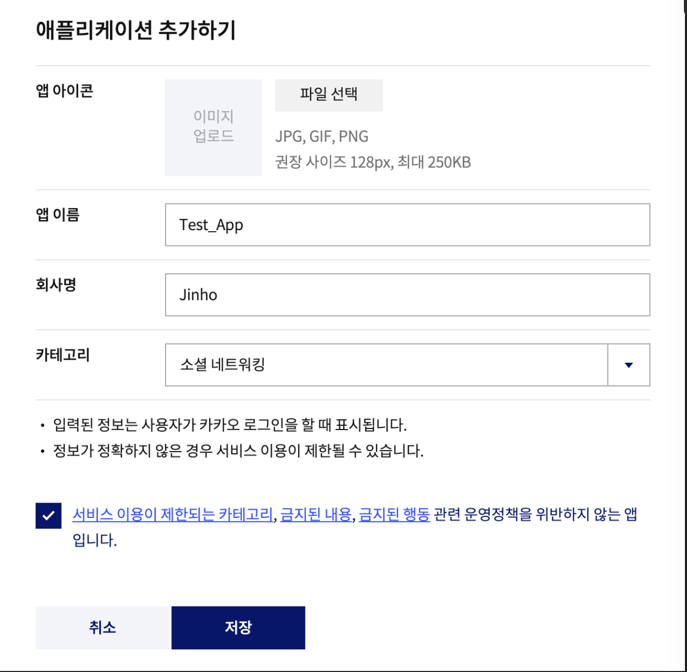

2. Web 플랫폼 등록
- 플랫폼으로 이동하여, 사이트 도메인을 추가시킴
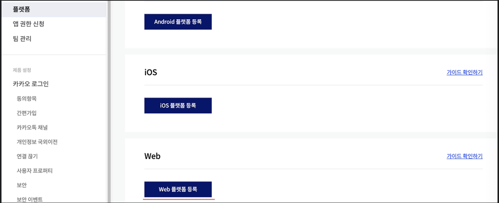

3. Local에서 테스트 할 예정이기에 http://localhost:8080 를 등록해줌(실제 배포를 했다면, 서버의 도메인 URL 중 하나를 등록해줌)
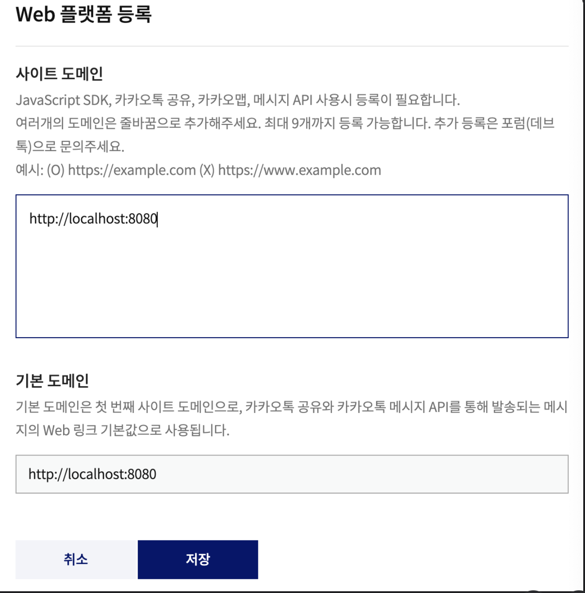

4. 아래처럼 등록되면 성공한 것

### 카카오 로그인 활성화
1. 카카오 로그인을 누르고, [카카오 로그인]을 활성화 해줌
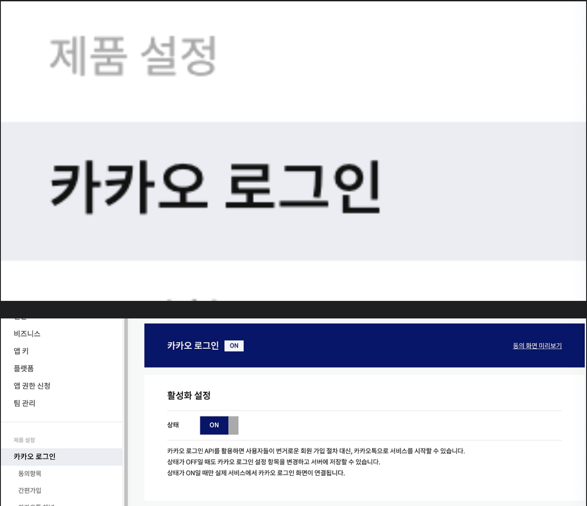

2. Redirect URI 설정
- 만약 프론트 쪽으로 인가 코드를 받고 싶으면 프론트 쪽 도메인으로 설정하면 됨
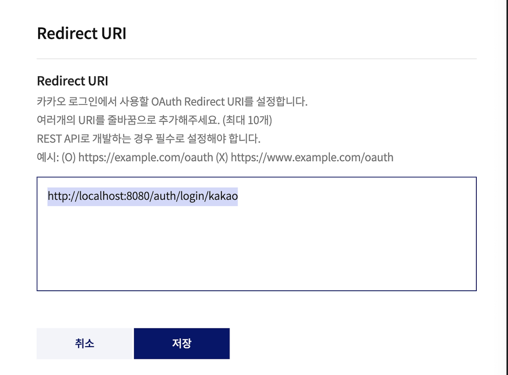

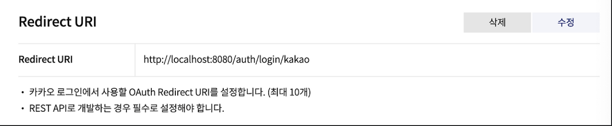

### 동의 항목 설정
- 마지막으로 사용자 정보를 요청하기 위해 동의 항목 설정
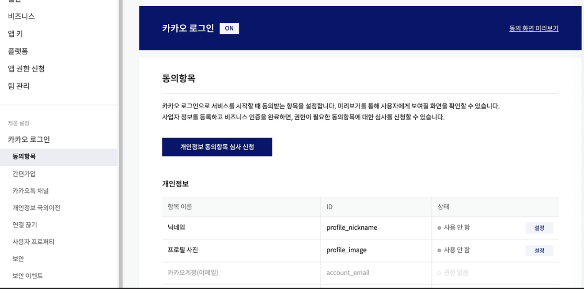
- '사용 안함'으로 되어있는 닉네임과 카카오 계정을 '필수 동의'로 변경하여 받아올 수 있게끔 해줘야 함
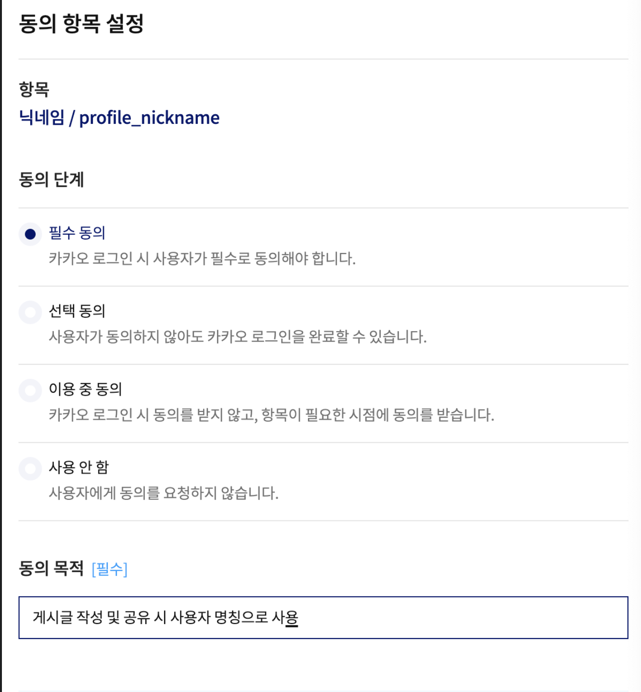

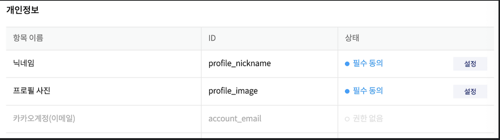

- 그러나 닉네임과 프로필 사진을 제외한 나머지 개인정보 항목에 대해서는 카카오 내의 검수가 필요함
- 사업자 정보를 등록하거나, 비즈니스 인증을 완료하면, 권한이 필요한 동의항목에 대한 심사를 신청할 수 있음
- 주의: 닉네임은 Unique 한 값이 아니기 때문에 식별자로 사용할 수 없음

### email까지 받아보고 싶다면?
- 비즈앱 등록만 한다면 email을 받을 수 있음

**비즈 앱 전환 - 이메일 수집**
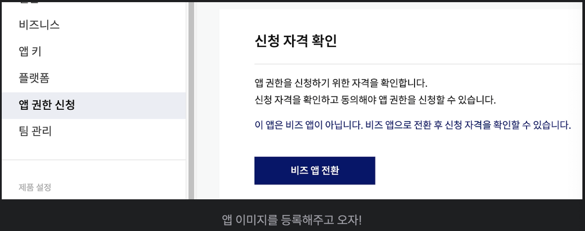
- 만약 이미지를 등록한 상태라면, 아래 [개인 개발자 비즈 앱 전환]을 눌러주면 됨

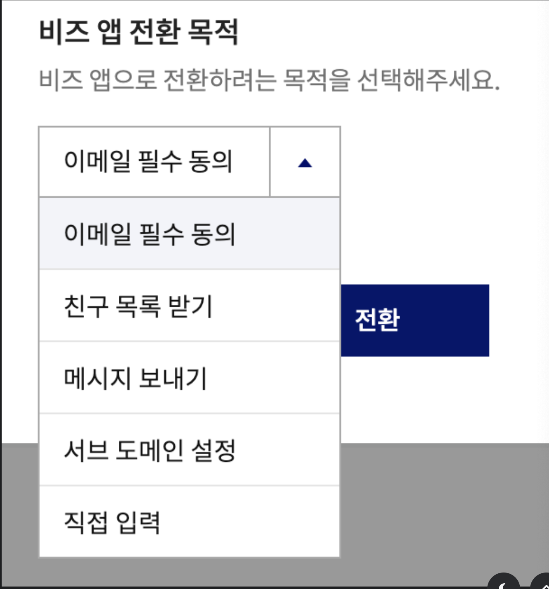

## 로그인 요청 / 인가 코드 받기
https://developers.kakao.com/docs/latest/ko/kakaologin/rest-api#request-code-sample
- 문서를 보면 다음과 같은 요청을 통해 인가 코드를 받을 수 있다고 적혀있음
~~~
https://kauth.kakao.com/oauth/authorize?response_type=code&client_id=${REST_API_KEY}&redirect_uri=${REDIRECT_URI}
~~~
- REDIRECT_URL는 아까 설정한 'http://localhost:8080/auth/login/kakao' 이며, REST_API_KEY는 홈페이지에서 확인할 수 있음

~~~
https://kauth.kakao.com/oauth/authorize?response_type=code&client_id=${REST_API_KEY}&redirect_uri=http://localhost:8080/auth/login/kakao
~~~
- REST_API_KEY를 추가하고 들어가면 카카오 로그인 화면이 보임

## 인가 코드로 Token 요청하기
### 필터 단에서 url 허용해주기
- 스프링 시큐리티를 사용하는 환경에서 OAuth 콜백 URL을 처리하기 위해서는 해당 URL에 대한 인증을 우회해야 함
- 그래야 filter 단에서 요청이 막히지 않고 controller단까지 오기 때문에 allowUrl에 추가해줘야 함
~~~java
public static final String[] allowUrls = {
    "/swagger-ui/**",
    "/swagger-resources/**",
    "/v3/api-docs/**",
    "/api/v1/posts/**",
    "/api/v1/replies/**",
    "/login",
    "/auth/login/kakao/**"
}
~~~

- 아래 경로별 인가에서 풀어줘야 함
~~~java
@Configuration
@EnableWebSecurity
public class SecurityConfig {

    @Bean
    public SecurityFilterChain filterChain(HttpSecurity http) throws Exception {
        // 다른 설정 중략
        http.authorizeHttpRequests(authorizeRequests -> authorizeRequests
            .requestMatchers(ALLOWED_URLS).permitALl()  // 허용 URL 설정
            .anyRequest().authenticated()  // 그 외 모든 요청은 인증 필요
        )
        .csrf().disable()  // CSRF 보호 비활성화 (API 서버의 경우)
        .formLogin().disable()  // 폼 로그인 비활성화
        .httpBasic().disable();  // HTTP Basic 인증 비활성화

    return http.build();
    }
}
~~~

### AuthController (Redirect_URL을 처리하는 컨트롤러)
- 앱에 등록된 Redirect URL에 전달된 code를 전달받아야 함
~~~java
@RestController
@RequiredArgsConstructor
@RequestMapping("")
public class AuthController {

    @GetMapping("/auth/login/kakao")
    public BaseResponse<UserResponseDto.JoinResultDto>kakaoLogin(@RequestParam("code") String accessCode, HttpServletResponse httpServletResponse) {
        User user = authService.oAuthLogin(accessCode, httpServletResponse);
        return BaseResponse.onSuccess(UserConverter.toJoinResultDto(user));
    }
}
~~~
- 이제 받아온 인가 코드로 토큰을 요청하면 됨
- kakao developer의 문서를 보면 https://kauth.kakao.com/oauth/token 주소로 적혀있는 header와 body를 가지고 요청하라고 되어 있음
- 그러나 코드를 작성하기 전 clientId는 유출되면 안되기 때문에, yml에 설정해주고 사용해야함
~~~yml
kakao:
auth:
    client: dc3741c4aaad93067048db400f8fff38
    redirect: http://localhost:8080/auth/login/kakao
~~~
- KakaoUtil에 선언
~~~java
@Component
@Slf4j
public class KakaoUtil {

    @Value("${spring.kakao.auth.client}")
    private String client;
    @Value("${spring.kakao.auth.redirect}")
    private String redirect;
}
~~~

### AuthService
~~~java
@Service
@RequiredArgsController
public class AuthService {
    private final KakaoUtil kakaoUtil;
    private final UserRepository userRepository;
    private final JwtUtil jwtUtil;
    private final PasswordEncoder passwordEncoder;

    @Override
    public User oAuthLogin(String accessCode, HttpServletResponse httpServletResponse) {
        KakaoDto.OAuthToken oAuthToken = kakaoUtil.requestToken(accessCode);
    }
}
~~~

### KakaoUtil
- 실제 인가 코드로 Token 요청하는 로직이 있는 메서드
- 이 전에, 서버는 기본적으로 클라이언트의 요청을 받아 리소스에 접근하고, 작업을 수행하는 곳임
- 만약 서버에서 요청을 보내야 한다면 RestTemplate과 WebClient 모두 HTTP 요청을 보내는 데 사용될 수 있는 Spring의 클라이언트들임
- OAuth 인증과 같은 간단한 HTTP 요청의 경우, RestTemplate 으로도 충분히 구현 가능하기에 해당 포스팅에서는 RestTemplate으로 구현
    - 하지만 비동기 처리가 필요하거나, 미래의 확장성을 고려한다면 WebClient를 선택하는 것이 좋을 수도

~~~java
@Configuration
public class RestTemplateConfig {

    @Bean
    public RestTemplate restTemplate() {
        RestTemplate restTemplate = new RestTemplate();

        List<HttpMessageConverter<?> messageConverters = new ArrayList<>();
        messageConverters.add(new FormHttpMessageConverter());
        restTemplate.setMessageConverters(messageConverters);

        return restTemplate;
    }
}
~~~

~~~java
@Component
@Slf4j
public class KakaoUtil {

    @Value("${spring.kakao.auth.client}")
    private String client;
    @Value("${spring.kakao.auth.redirect}")
    private String redirect;

    public KakaoDto.OAuthToken requestToken(String accessCode) {
        RestTemplate restTemplate = new RestTemplate();
        HttpHeaders headers = new HttpHeaders();
    }
}
~~~

- 이 후 Kakao Developer에서 잘 명시되어 있던 header 형식과 body 형식에 맞추어 코드를 작성해주면 됨
~~~java
public KakaoDTO.OAuthToken requestToken(String accessCode) {
        RestTemplate restTemplate = new RestTemplate();
        HttpHeaders headers = new HttpHeaders();
        headers.add("Content-type", "application/x-www-form-urlencoded;charset=utf-8");

        MultiValueMap<String, String> params = new LinkedMultiValueMap<>();
        params.add("grant_type", "authorization_code");
        params.add("client_id", client);
        params.add("redirect_url", redirect);
        params.add("code", accessCode);
}
~~~

- 카카오 API 반환하는 JSON 형식의 응답 데이터를 보다 쉽게 다루기 위해, JSON 데이터 구조에 맞는 Java 클래스(DTO)를 만들어야 함
~~~java
public class KakaoDto {

    @Getter
    public static class OAuthToken {
        private String access_token;
        private String token_type;
        private String refresh_token;
        private int expires_in;
        private String scope;
        private int refresh_token_expires_in;
    }
}
~~~