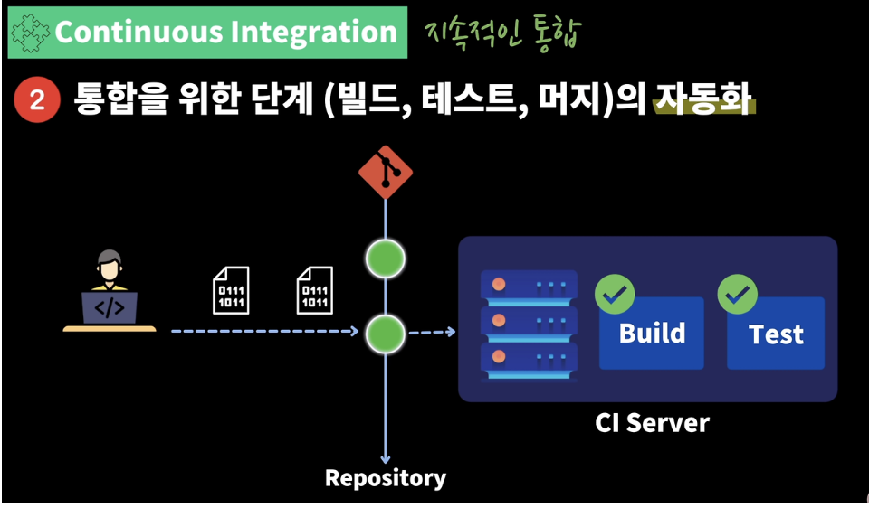
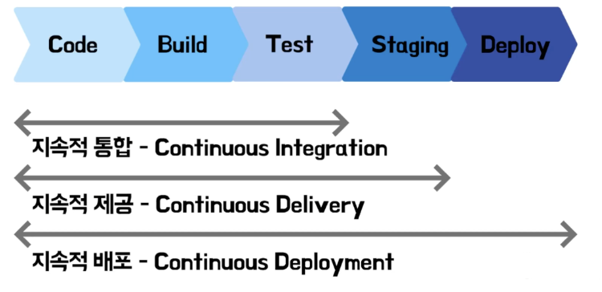
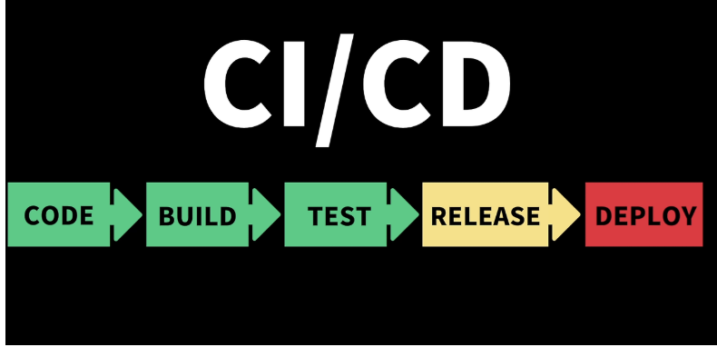

# CI/CD란?
- CI/CD는 애플리케이션 개발부터 배포까지 모든 단계를 자동화하여 효율적이고 빠르게 사용자에게 빈번히 배포할 수 있도록 하는 개념
- 이는 DevOps 엔지니어의 핵심 업무

## CI(Continuous Integration)란?
- 지속적인 통합이라는 의미로, 작업한 코드를 주기적으로 빌드 및 테스트하여 레포지토리에 통합(merge)하는 것
- 다시 말해 버그 수정, 새로운 기능 개발한 코드가 주기적으로 Main Repository에 병합되는 것을 의미

### CI의 2가지 Point
**1. 코드 변경사항을 주기적으로 빈번하게 merge**
예시) [A개발자], [B개발자] 모두 a.js 파일을 작업 후 오랜 기간이 지나고 merge 하게 된다면 ??
- 코드가 충돌하게 되고 오랫동안 꼬여버린 코드를 병합하는데 시간이 오래 걸리게 됨
- 오히려 코드 작성시간보다 코드 충돌해결 시간에 더 많은 시간을 할애해야 할 수도 있음
- 따라서 작은 단위로 개발하여 '주기적으로 빈번하게 머지해야 함'

**2. 통합 단계의 자동화(통합을 위한 단계)**
예시) 팀 내 개발자들이 배포에 적용할 기능 개발 후 하루에 수십 번 Main Branch에 Merge를 진행한다면 ??
- 팀장(혹은 리뷰어)가 팀 내 모든 개발자들의 코드를 빌드, 테스트, 배포까지 하는 것은 엄청난 반복 작업임
- 따라서 코드 변경사항을 Build 하고 Test 하는 과정을 자동화하면 귀찮은 반복 작업을 생략할 수 있으며, 시간도 절약됨

**통합 자동화 예시 - CI 자동화(통합 자동화를 사용하게 된다면)**

1. 개발자가 코드 수정 후 MR 혹은 PR을 요청
2. 프로젝트에 작성된 CI Script를 기반으로 변경 및 추가된 코드를 자동으로 Build Test 진행(Unit Test, Integration Test 등..)
3. 이때 모두 성공 시 MR 혹은 PR이 성공, 과정 중 하나라도 실패 시 병합 거절(Close)

### CI의 장점
1. 개발 생산성 향상
2. 문제점을 빠르게 발견
3. 코드의 퀄리티 향상

## CD(Continuous Delivery & Continuous Deployment)
- CD는 지속적인 제공(Continuous Delivery)과 지속적인 배포(Continuous Deployment) 두 가지 의미를 가짐
- 두 가지 모두 다 마지막 배포 단계에서 "어떻게 하면 자동화해서 배포를 만들 수 있을까?"를 고민하는 단계
- 가장 큰 차이점은 '수동 배포, 자동 배포' 라고 생각하면 됨

### CD(Continuous Delivery) 지속적인 제공
- CI 단계에서 빌드되고 테스트된 후, 배포 준비 상태가 확인되면 개발자 혹은 검증팀이 수동으로 배포하는 것

### CD(Continuous Deployment) 지속적인 배포
- CI 단계에서 빌드되고 테스트된 후, 배포 준비 상태가 확인되면 자동으로 배포까지 진행하는 것

### 지속적 제공과 지속적 배포

- Code -> Build -> Test -> Staging 까지 자동으로 진행 후 Deploy 과정을 수동으로 한다면 => Continuous Delivery(지속적 제공)
- Code -> Build -> Test -> Staging -> Deploy 과정 전부를 자동으로 진행하는 경우
=> Continuous Deployment(지속적 배포)
- 따라서 최종단계가 자동화가 되었는지 여부에 차이라고 이해하면 됨

### 예시
1. 회사 A : "test 코드를 자동으로 한다 하더라도 Design 적인 부분은 자동으로 확인이 되지 않아! 따라서 우리는 수동으로 product 서버에 배포하는 'Continuous Delivery(지속적 제공)을 사용합니다. 최종 배포는 QA 팀에서 검수 후 진행해 주세요.'

2. 회사 B : "디자인적인 부분이 이슈가 발생되어도 수정시 바로 product 서버까지 '빠르게' 배포가 가능하니 'Continuous Deployment(지속적 배포)를 사용합니다. QA 팀은 항시적으로 Product 서버 기준으로 테스트 해주시고 배포는 DevOps(or 개발팀)에서 맡아주세요.'

- 회사마다 내부 상황을 고려하여 Continuous Delivery, Continuous Deployment를 선택하여 사용

## CI/CD 파이프라인 정리

1. 개발자가 작은 단위로 기능을 분리하여 주기적으로 Main Repository에 Merge
2. 자동으로 Build
3. 자동으로 Test 진행
4. RELEASE 준비 상태
    1. 수동 배포
    2. 자동 배포