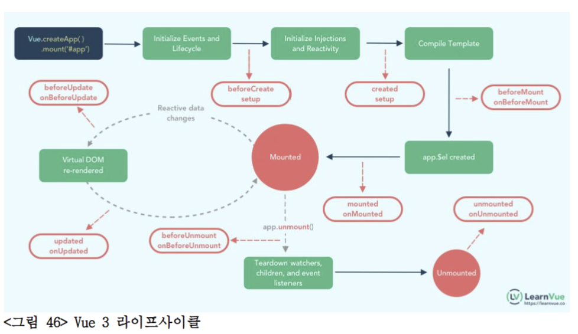
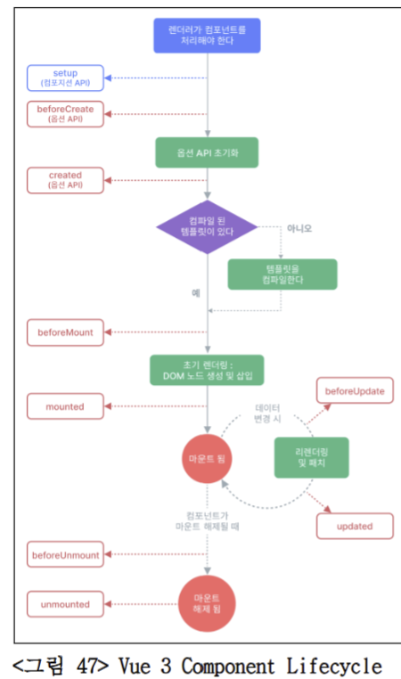

# WebRTC를 활용한 그룹 비디오 컨퍼런스 서비스_Day01

## Front-end 확장자에 대한 이해 및 활용 

1. ESLint: 
- JavaScript 코드 정적 분석(문법/스타일/잠재 오류 검사) 도구
- 코드 저장할 때 자동으로 eslint 검사하고 밑줄 표시, 빠른 수정 제공
- 기본 파일 (.eslintrc, .eslintignore, eslintConfig (package.json 안))

2. EditorConfig:
- VS Code에 설치하면 .editorconfig 파일이 있을 때 들여쓰기 크기, 파일 끝 빈 줄, 같은 설정을 VS Code가 자동으로 적용 
- 팀원마다 IDE가 달라도 같은 코드 스타일 유지 가능

### 📌 .editorconfig 예시

아래 설정을 프로젝트 루트에 `.editorconfig` 파일로 저장하면,
VS Code 및 다른 에디터에서 자동으로 코딩 스타일을 맞춰줍니다.

```ini
# EditorConfig is awesome: https://editorconfig.org

root = true

[*]
indent_style = space
indent_size = 2
end_of_line = lf
charset = utf-8
trim_trailing_whitespace = true
insert_final_newline = true

[*.md]
trim_trailing_whitespace = false
```

## Vue3의 특징 및 구성 요소들과 라이브러리 이해

1. 어플리케이션 인스턴스 생성:
- Vue3는 인스턴스 생성에 crateApp 함수를 사용하며, 여러 의존 라이브러리에서도 Vue3의 인스턴스 생성방식을 도입

``` javascript
import { createI18n } from 'vue-i18n'
const i18n = createI18n({})

import {createRouter, createWebHistory} from 'vue-router'
const router = createRouter({
    history: createWebHistory(),
    routes
})

import {createStore} from "vuex";
```

2. fragments:
- 다중 루트 노드 컴포넌트인 fragments를 공식 지원

``` javascript
<template>
    <div>
        <h1>제목1</h1>
        <p>내용1</p>
    </div>
    <div>
        <h1>제목2</h1>
        <p>내용2</p>
    </div>
</template>
```

3. Composition API:
- 코드의 재사용성과 가독성을 높이고, 유지보수 측면에서도 효율을 높여 코드 내 논리적 관심사에 더 집중하게 함

``` javascript
export default {
    setup() {
        const state = reactive(
            {
                viewType: 'map',
                selectAllFloor: false,
            }
        )
        const _chamgeViewType (type) {
            ...
        }
        const _bodyLoading (isLoading) {
            ...
        }
        return {
            stat, _changeViewType, _bodyLoading
        }
    }
} 
```
4. Lifecycle Hooks:
- 접두어 "on"을 추가하여 컴포넌트의 라이프사이클 훅에 접근 가능

``` javascript
import { onBeforeMount, onUpdated } from 'vue'

export default {
    setup() {
        onBeforeMount (() => {
            ...
        })
        onUpdated (() => {
            ...
        })
        return {
            ...
        }
    }
}
```

5. props와 emit의 분리:
- props와 emit을 Composition API의 setup()에서 전달인자로 명시하는 방식을 사용하여 가독성을 높임
``` javascript
export default {
    props: {
        title: String
    },
    setup(props) {
        console.log(pros.title)
    }
}

export default {
    setup(pros, { emit }) {
        ...
    }
}
```

| Options API      | setup() 내부 훅                                              |
|------------------|-----------------------------------------------------------|
| beforeCreate     | setup()에서는 불필요.                                       |
| created          | setup()에서는 불필요.                                       |
| beforeMount      | onBeforeMount                                              |
| mounted          | onMounted                                                  |
| beforeUpdate     | onBeforeUpdate                                              |
| updated          | onUpdated                                                  |
| beforeUnmount    | onBeforeUnmount                                            |
| unmounted        | onUnmounted                                                |
| errorCaptured    | onErrorCaptured                                            |
| renderTracked    | onRenderTracked                                            |
| renderTriggered  | onRenderTriggered - Virtual DOM의 재 렌더링이 발생한 후 호출 |
| Activated        | onActivated                                                |
| deactivated      | onDeactivated                                              |

6. Vue3의 라이프사이클 

