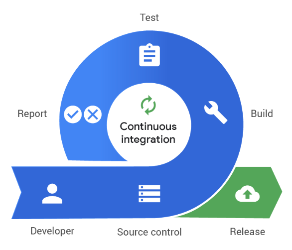
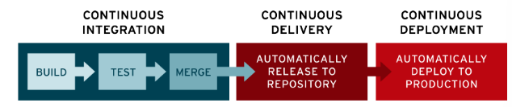

# 1. CI (Continuous Integration)
### 정의
지속적인 통합.           
어플리케이션의 새로운 코드 변경 사항이 정기적으로 빌드 및 테스트 되어 공유 레포지토리에 통합하는 것을 의미한다.

### CI가 필요한 환경
- 다수의 개발자가 형상관리 툴을 공유하여 사용하는 환경
다수의 개발자가 함께하는 프로젝트의 경우 공유 레포지토리에 수많은 commit이 쌓이게 된다. 이때 자동화된 빌드&테스트는 원천 소스코드의 충돌 등을 방어하는 장점을 제공한다.

- MSA 환경
모든 기능을 포함하는 하나의 거대한 서비스인 기존의 어플리케이션과 다르게 MSA는 작은 기능멸로 서비스를 잘게 쪼개어 개발하는 형태를 의미한다.    
MSA 환경에서는 대부분 Agile 방법론이 적용되기 때문에 기능 추가가 매우 빈번하게 발생한다. 이런 상황에서 CI의 적용은 기능 충돌 방지 등의 장점이 있다.

### 핵심 목표
1. 버그를 신속하게 찾아 해결
2. 소프트웨어의 품질을 개선
3. 새로운 업데이트의 검증 및 릴리즈의 시간을 단축

# 2. CD(Cotinuous Delivery & Continuous Deployment)
### 정의
지속적인 서비스 제공, 지속적인 배포라는 의미이다.

Continuous Delivery는 공유 레포지토리로 자동으로 릴리즈 하는 것,

Continous Deployment는 Production 레벨까지 자동으로 deploy하는 것을 의미.

CD는 개발자의 변경사항이 레포지토리를 넘어, 고객의 프로덕션 환경까지 릴리즈되는 것을 의미.

- 소프트웨어가 언제든지 신뢰 가능한 수준의 버전을 유지할 수 있도록 지원하는 것이 CD의 역할

# 3. DevOps 엔지니어의 역할
CI/CD를 위한 파이프라인을 구성하고 이를 자동화 단계까지 이끄는 역할을 한다. 중간 모니터링 지표를 구성하여, 개발자들의 개발 방향을 가이드한다. 이를 통해 최종적으로 고객들에게 안정적이고 신뢰성 높은 서비스 프로덕션을 제공한다.

- 개발과 운영을 결합하는 DevOps
- 운영부서: 서비스의 안정성과 빠른 성능을 유지하는 데 집중
- 개발부서: 오류가 발생했을 때 버그를 수정하거나 사용자들의 요구를 반영하여 빠르게 새로운 기능을 제공하는데 집중

